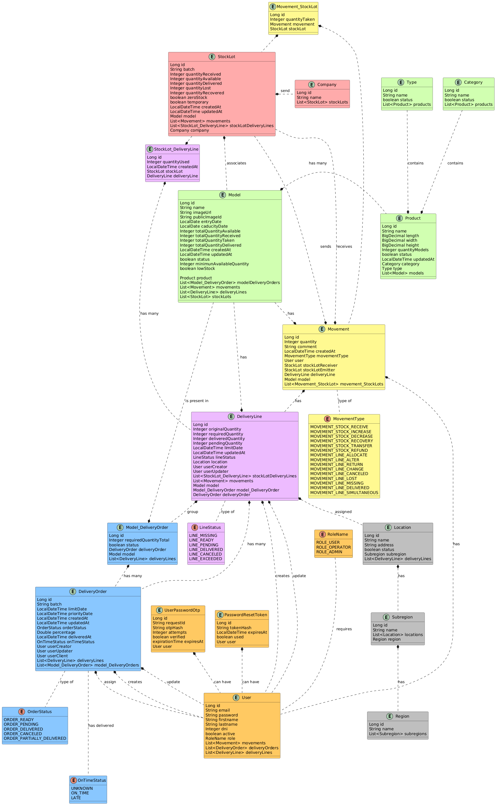

# API REST para la aplicación de gestión de inventario de imprenta

Autor: Armando Enrique Kaneko Diaz

## Descripción

El proyecto está construido siguiendo una arquitectura de **monolito modular**, donde cada módulo encapsula su propio dominio y mantiene una arquitectura en capas para mejorar la organización, escalabilidad y mantenibilidad del sistema.

Los servicios compartidos se encuentran en un módulo `common` reducido, evitando acoplamiento innecesario entre módulos.

La API proporciona autenticación, gestión de usuarios, productos, categorías, imágenes y operaciones relacionadas con el inventario.

## Vista previa

[Proyecto desplegado en render](https://api-rest-inventory-2.onrender.com/api)

## Características

- Arquitectura monolítica modular
- Arquitectura en capas
- Autenticación JWT
- Roles y autorización
- Gestión de usuarios
- Gestión de productos
- Gestión de categorías
- Gestión de ordenes de entrega
- Subida de imágenes con Cloudinary
- Envío de correos electrónicos
- Variables de entorno seguras
- Modo demo configurable
- API REST escalable y mantenible

## Diagrama UML

## Variables de entorno

`PORT` = Puerto donde se ejecutará la aplicación. En Render debe ser `10000`.

`SPRING_DATASOURCE_URL` = URL de conexión a la base de datos MySQL.

`SPRING_DATASOURCE_USERNAME` = Usuario de la base de datos MySQL.

`SPRING_DATASOURCE_PASSWORD` = Contraseña de la base de datos MySQL.

`TEST_ENV_VAR` = Variable utilizada para pruebas internas y validaciones durante el desarrollo.

`DEFAULT_IMAGE_URL` = URL de la imagen por defecto que se asignará cuando un producto o usuario no tenga imagen subida.

`FIRST_USER_EMAIL` = Correo electrónico del primer usuario administrador creado automáticamente al iniciar la aplicación.

`FIRST_USER_PASSWORD` = Contraseña del primer usuario administrador creado automáticamente.

`MAILERSEND_API_TOKEN` = Token de autenticación de MailerSend utilizado para el envío de correos electrónicos.

`MAILERSEND_TEST_DOMAIN` = Dominio configurado en MailerSend para realizar pruebas de envío de correos.

`CLOUDINARY_CLOUD_NAME` = Nombre de la nube de Cloudinary utilizada para almacenar imágenes.

`CLOUDINARY_API_KEY` = API Key de Cloudinary utilizada para autenticación.

`CLOUDINARY_API_SECRET` = API Secret de Cloudinary utilizada para autenticación segura.

`FRONTEND_URL` = URL del frontend autorizada para comunicarse con la API REST.

`DEMO_MODE` = Activa o desactiva el modo demo de la aplicación. Debe ser `true` o `false`. Cuando está activado, se crean automáticamente usuarios de prueba ineditables.

## Licencia

Este proyecto es de uso educativo y de portafolio.
